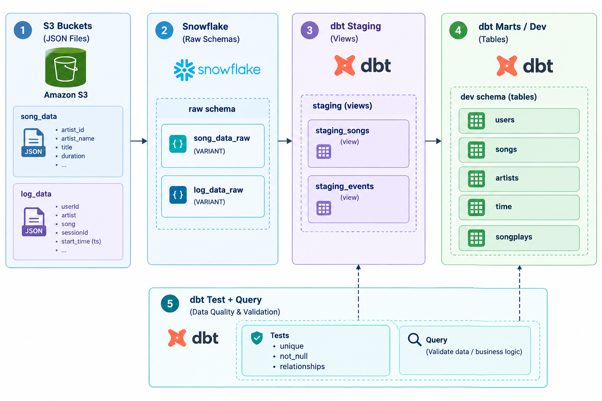

# Sparkify Data Warehouse — dbt + Snowflake

A modern rebuild of the classic Sparkify data warehousing project, using **dbt** and **Snowflake** instead of Amazon Redshift. Raw song and user-activity logs (JSON) are loaded from S3 into Snowflake and transformed with dbt into an analytics-ready star schema.

## Project flow



1. **S3 bucket** — holds the raw `song_data` and `log_data` JSON files, untouched.
2. **Snowflake raw schema** — `COPY INTO` loads each JSON file into a single `VARIANT` column (`song_data_raw`, `log_data_raw`). Nothing is parsed yet.
3. **dbt staging (views)** — `staging_songs` and `staging_events` flatten the VARIANT data into typed columns, filtering log events down to `NextSong` only.
4. **dbt marts / dev schema (tables)** — the star schema itself: `users`, `songs`, `artists`, `time` dimension tables plus the `songplays` fact table, built by joining staging events to staging songs.
5. **dbt test + query** — `dbt test` runs `unique` / `not_null` / `relationships` checks (Snowflake doesn't enforce real foreign keys, so this is the substitute), then the mart tables are ready to query.

Running `dbt run && dbt test` re-executes staging → marts → tests on every change.

## Table schema (star schema)

.png)

**Fact table**
- `songplays` — songplay_id, start_time, user_id, level, song_id, artist_id, session_id, location, user_agent

**Dimension tables**
- `users` — user_id, first_name, last_name, gender, level
- `songs` — song_id, title, artist_id, year, duration
- `artists` — artist_id, name, location, latitude, longitude
- `time` — start_time, hour, day, week, month, year, weekday

`songplays` sits at the center, joined to every dimension on its respective key. Referential integrity between them is enforced by dbt's `relationships` tests, not database-level foreign keys.

## File structure

```
sparkify-dbt-snowflake/
├── README.md
├── dbt_project.yml
├── packages.yml
├── image1.png                  # project flow diagram
├── image (1).png                # table schema diagram
├── data/
│   ├── song_data/               # raw song JSON files
│   └── log_data/                # raw event log JSON files
├── sql/
│   └── setup.sql                # Snowflake warehouse/db/schema/stage/integration DDL
└── models/
    ├── sources.yml               # declares raw.song_data_raw / raw.log_data_raw
    ├── staging/
    │   ├── staging_songs.sql
    │   └── staging_events.sql
    └── marts/
        ├── users.sql
        ├── songs.sql
        ├── artists.sql
        ├── time.sql
        ├── songplays.sql
        └── schema.yml            # dbt tests (unique, not_null, relationships)
```

## Prerequisites

- An AWS account with an S3 bucket and an IAM role Snowflake can assume
- A Snowflake account
- Python 3.9+
- Git

## How to clone and use this project

### 1. Clone the repo

```bash
git clone https://github.com/<your-username>/sparkify-dbt-snowflake.git
cd sparkify-dbt-snowflake
```

### 2. Upload the raw data to your own S3 bucket

```bash
aws s3 mb s3://<your-bucket-name>
aws s3 cp data/song_data/ s3://<your-bucket-name>/song_data/ --recursive --acl bucket-owner-full-control
aws s3 cp data/log_data/ s3://<your-bucket-name>/log_data/ --recursive --acl bucket-owner-full-control
```

### 3. Set up Snowflake objects

Run `sql/setup.sql` in a Snowflake worksheet — it creates the warehouse, database, raw schema, file format, storage integration, and stages.

```sql
desc integration s3_storage_integration;  -- copy STORAGE_AWS_IAM_USER_ARN and STORAGE_AWS_EXTERNAL_ID
```

Paste those two values into your IAM role's **Trust relationships** policy in AWS, and grant `s3:GetObject`, `s3:ListBucket`, `s3:GetObjectVersion` on your bucket in the role's **Permissions** policy.

### 4. Load the raw data into Snowflake

```sql
list @sparkify_db.raw.song_stage;   -- confirm access first
copy into sparkify_db.raw.song_data_raw from @sparkify_db.raw.song_stage
    file_format = (format_name = sparkify_db.raw.json_format)
    on_error = 'continue';

copy into sparkify_db.raw.log_data_raw from @sparkify_db.raw.log_stage
    file_format = (format_name = sparkify_db.raw.json_format)
    on_error = 'continue';
```

### 5. Set up your local environment

```bash
python -m venv venv
# Windows
.\venv\Scripts\Activate.ps1
# macOS/Linux
source venv/bin/activate

pip install dbt-snowflake
dbt deps
```

### 6. Configure your dbt profile

Create `~/.dbt/profiles.yml`:

```yaml
sparkify_dbt:
  target: dev
  outputs:
    dev:
      type: snowflake
      account: <your_account_locator>
      user: <your_user>
      password: <your_password>
      role: <your_role>
      database: sparkify_db
      warehouse: sparkify_wh
      schema: dev
      threads: 4
```

### 7. Run the project

```bash
dbt run
dbt test
dbt docs generate
dbt docs serve
```

### 8. Verify

```sql
select * from sparkify_db.staging.staging_songs limit 10;
select * from sparkify_db.staging.staging_events limit 10;
select * from sparkify_db.dev.songplays limit 10;
```

## License

MIT — feel free to fork and adapt for your own learning.
